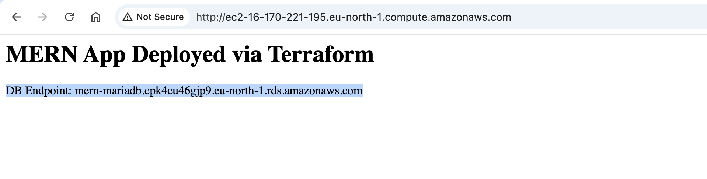
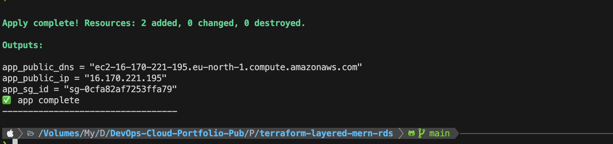

# Terraform Layered Infrastructure - MERN Stack with RDS

## 🎯 Project Goal

This project demonstrates a **production-grade layered Terraform architecture** that solves real-world infrastructure challenges by separating responsibilities, avoiding dependency chaos, and maintaining clean, reusable state files.

---

## 🔴 The Problem (Before Layering)

When all infrastructure lives in a **single Terraform project**:

| Problem | Impact |
|---------|--------|
| **Single State File** | All resources (VPC, RDS, EC2, etc.) stored in one state → slow applies & high risk |
| **Full Stack Refresh** | Small changes (e.g., security group edit) force Terraform to scan entire infrastructure |
| **State Locking Conflicts** | Multiple engineers working on different components cause blocking |
| **Risky Destroys** | Destroying one resource (e.g., RDS) risks deleting the entire stack |
| **Tight Coupling** | Network changes can accidentally affect database or app layers |

### Example Scenario:
```bash
terraform apply  # in monolithic directory
```
Could unintentionally modify or delete network resources when only the app was being changed.

---

## ✅ The Solution (Layered Design)

We split the infrastructure into **3 independent layers** with isolated state files:

```
┌─────────────────────────────────────────────────────────────┐
│                    LAYER 1: NETWORK                         │
│  ┌──────────────────────────────────────────────────────┐   │
│  │  VPC, Subnets, Route Tables, Internet Gateway       │   │
│  │  State: s3://bucket/network/terraform.tfstate       │   │
│  └──────────────────────────────────────────────────────┘   │
└─────────────────────────────────────────────────────────────┘
                            ↓ (outputs: vpc_id, subnet_ids)
┌─────────────────────────────────────────────────────────────┐
│                   LAYER 2: DATABASE                         │
│  ┌──────────────────────────────────────────────────────┐   │
│  │  RDS MariaDB, DB Security Group, Subnet Group       │   │
│  │  State: s3://bucket/database/terraform.tfstate      │   │
│  └──────────────────────────────────────────────────────┘   │
└─────────────────────────────────────────────────────────────┘
                            ↓ (outputs: db_endpoint, rds_sg_id)
┌─────────────────────────────────────────────────────────────┐
│                     LAYER 3: APP                            │
│  ┌──────────────────────────────────────────────────────┐   │
│  │  EC2 Instance, App Security Group, SG Rules         │   │
│  │  State: s3://bucket/app/terraform.tfstate           │   │
│  └──────────────────────────────────────────────────────┘   │
└─────────────────────────────────────────────────────────────┘
```

### Key Architecture Principles:

1. **Isolated State Files** - Each layer has its own S3 backend:
   - `network/terraform.tfstate`
   - `database/terraform.tfstate`
   - `app/terraform.tfstate`

2. **Remote State Data Sources** - Layers consume outputs from previous layers:
   ```hcl
   data "terraform_remote_state" "network" {
     backend = "s3"
     config = {
       bucket = "terraform-layered-mern-rds-state"
       key    = "network/terraform.tfstate"
       region = "eu-north-1"
     }
   }
   ```

3. **Clear Dependency Flow** - Unidirectional dependencies prevent circular references:
   ```
   Network → Database → App
   ```

4. **Independent Lifecycle** - Each layer can be applied, updated, or destroyed independently

---

## 📊 What We Fixed

| Before (Monolithic) | After (Layered) |
|---------------------|-----------------|
| All resources in one state → slow & risky applies | 3 isolated layers with separate backends |
| Circular dependencies between modules | Clear flow: Network → DB → App |
| Manual variable passing between stacks | Remote state outputs used automatically |
| Risky full-stack destroys | Each layer destroys only its own resources |
| Hard to collaborate (state locking) | Engineers work in separate layers safely |
| Network change affects everything | Network stable, rarely changes |

---

## 🏗️ Project Structure

```
terraform-layered-mern-rds/
├── layers/
│   ├── network/              # Layer 1: VPC, Subnets, IGW, Route Tables
│   │   ├── backend.tf        # S3 backend: network/terraform.tfstate
│   │   ├── main.tf           # VPC resources
│   │   ├── outputs.tf        # vpc_id, subnet_ids, igw_id
│   │   └── variables.tf
│   │
│   ├── database/             # Layer 2: RDS MariaDB
│   │   ├── backend.tf        # S3 backend: database/terraform.tfstate
│   │   ├── main.tf           # RDS + Security Group + remote_state(network)
│   │   ├── outputs.tf        # db_endpoint, rds_sg_id, db_name
│   │   └── variables.tf
│   │
│   └── app/                  # Layer 3: EC2 Application
│       ├── backend.tf        # S3 backend: app/terraform.tfstate
│       ├── main.tf           # EC2 + App SG + remote_state(network, database)
│       ├── outputs.tf        # instance_id, public_ip
│       └── variables.tf
│
├── envs/
│   └── prod.tfvars           # Environment-specific variables
│
├── scripts/
│   └── create-s3-backend.sh  # Creates S3 bucket with versioning & object lock
│
├── deploy.sh                 # Automated deployment script (apply/destroy)
├── .gitignore
└── README.md
```

---

## 🚀 Deployment

### Prerequisites
- AWS CLI configured with credentials
- Terraform >= 1.0
- Bash shell

### Step 1: Create S3 Backend
```bash
./scripts/create-s3-backend.sh
```
Creates S3 bucket with:
- Versioning enabled
- Object Lock (Governance mode, 1-day retention)
- Region: `eu-north-1`

### Step 2: Deploy All Layers
```bash
chmod +x deploy.sh
./deploy.sh apply
```
Deploys in order:
1. Network layer (VPC, subnets)
2. Database layer (RDS MariaDB)
3. App layer (EC2 instance)

### Step 3: Destroy Infrastructure
```bash
./deploy.sh destroy
```
Destroys in reverse order:
1. App layer
2. Database layer
3. Network layer

> **Note**: The script automatically handles the correct order for both deployment and destruction to respect layer dependencies.

---

## 🔧 Manual Layer Management

### Deploy Single Layer
```bash
cd layers/network
terraform init
terraform apply -var-file=../../envs/prod.tfvars
```

### Destroy Single Layer
```bash
cd layers/app
terraform destroy -var-file=../../envs/prod.tfvars
```

---

## 📦 Resources Created

### Network Layer
- 1x VPC (`10.0.0.0/16`)
- 2x Public Subnets (AZ-a, AZ-b)
- 1x Internet Gateway
- 1x Route Table + Associations

### Database Layer
- 1x RDS MariaDB (`db.t3.micro`)
- 1x DB Subnet Group
- 1x Security Group (port 3306)

### App Layer
- 1x EC2 Instance (`t3.small`)
- 1x Security Group (ports 22, 80)
- 1x Security Group Rule (App → DB)

---

## 🔐 State Management

All state files stored in S3 with:
- **Bucket**: `terraform-layered-mern-rds-state`
- **Region**: `eu-north-1`
- **Versioning**: Enabled (rollback capability)
- **Object Lock**: Governance mode (prevents accidental deletion)

State file paths:
```
s3://terraform-layered-mern-rds-state/
├── network/terraform.tfstate
├── database/terraform.tfstate
└── app/terraform.tfstate
```

---

## 🎯 Final Result

✅ **Network state** → Stable, rarely changes  
✅ **Database state** → Can be destroyed/rebuilt without touching VPC  
✅ **App state** → Redeploy anytime without affecting DB  
✅ **All states** → Versioned, locked, stored in S3 for safety  
✅ **Team collaboration** → Engineers work in isolated layers without conflicts  

---

## 📸 Deployment Results

### Network Layer Deployment


### Database & App Layer Deployment


---

## 📝 Key Takeaways

1. **Separation of Concerns** - Each layer has a single responsibility
2. **Reduced Blast Radius** - Changes affect only the target layer
3. **Faster Applies** - Smaller state files = faster operations
4. **Safe Collaboration** - Multiple teams can work in parallel
5. **Production-Ready** - Versioned state + object lock = disaster recovery

---

## 🛠️ Technologies Used

- **Terraform** - Infrastructure as Code
- **AWS VPC** - Network isolation
- **AWS RDS** - Managed MariaDB database
- **AWS EC2** - Application hosting
- **S3** - Remote state backend
- **Bash** - Automation scripts

---

## 📧 Author

Built to demonstrate real-world Terraform best practices for layered infrastructure management.
